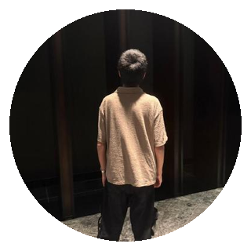

  

  

<h1 align="center">
  Kartik
  
</h1>

  <a href="https://x.com/1kartikkabadi1">@1kartikkabadi1</a>

<strong>16. OSS. AI.</strong>

  Contributor <a href="https://trysynara.com">@trySynara</a>
   
  39.9575° N, 26.2389° E

  <a href="https://github.com/Emanuele-web04/synara">Synara</a>
  ·
  <a href="https://github.com/kartikkabadi/synara-beta">synara-beta</a>
  ·
  <a href="https://trysynara.com">trysynara.com</a>
  ·
  <a href="https://x.com/1kartikkabadi1">X</a>

